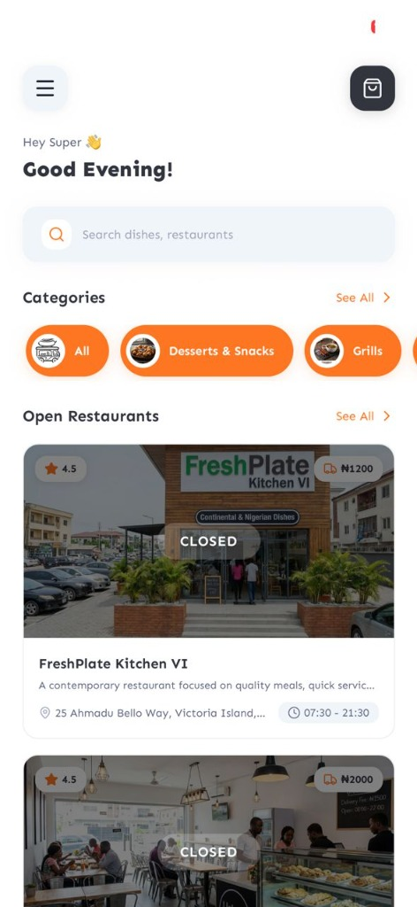
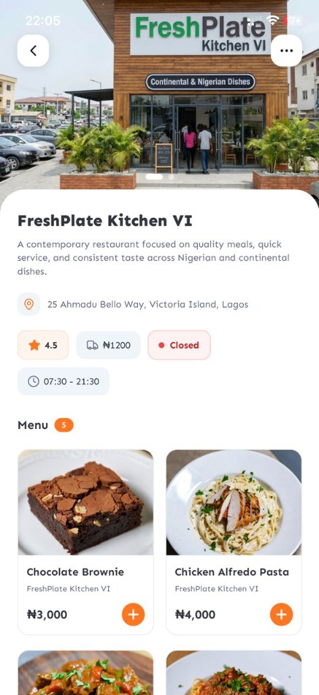
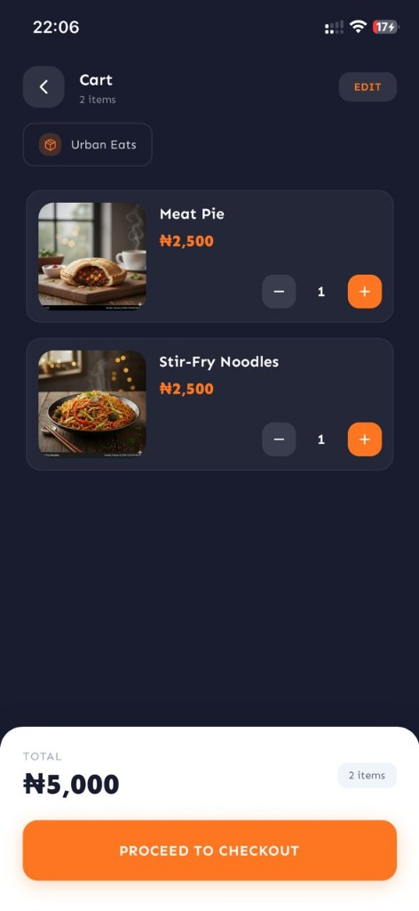
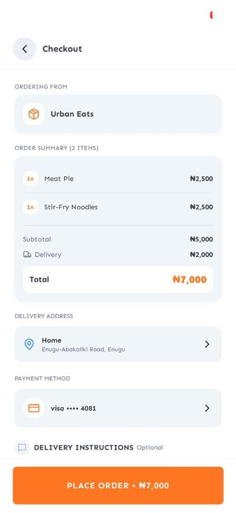

# DFood - Food Delivery App

A full-featured food delivery mobile application built with React Native, Expo, and TypeScript. DFood provides a seamless experience for ordering food from local restaurants, with secure Paystack payments, real-time push notifications, address management, and an intuitive user interface.

## Screenshots

<table>
  <tr>
    <td align="center"><br/><strong>Home</strong></td>
    <td align="center"><br/><strong>Restaurant Details</strong></td>
    <td align="center"><br/><strong>Cart</strong></td>
    <td align="center"><br/><strong>Checkout</strong></td>
  </tr>
</table>

## Design

The UI is based on a community Figma design:
[View Figma Design](https://www.figma.com/design/H0HAOQyTT8cwNWAesP1qj5/Food-Delivery-App--Community-?node-id=223-3474&p=f&t=kocdsyHaTNUQPE3q-0)

## Features

### Authentication and User Management

- JWT-based authentication with secure token persistence via Expo SecureStore
- User registration with email and password
- OTP-based password recovery flow
- Profile management (name, phone number, profile picture)
- Session persistence across app restarts

### Food Discovery

- Dynamic home feed with personalized restaurant recommendations
- Real-time search across restaurants and food items
- Category-based browsing
- Detailed restaurant profiles with menus and ratings
- Comprehensive food item details with image carousels

### Shopping and Cart

- Persistent cart using Zustand with AsyncStorage
- Favorites system for saved dishes
- Single-restaurant cart enforcement with switching alerts
- Quantity management with increment/decrement controls

### Delivery and Addresses

- Interactive map integration for address selection
- Save multiple addresses (home, work, custom)
- GPS-based auto-location detection
- Full CRUD operations for saved addresses
- Default address selection

### Payment Processing

- Cash on delivery and card payment support
- Paystack integration for secure card processing
- Saved payment methods
- Payment history tracking

### Order Management

- Single-screen checkout flow
- Order confirmation with tracking number
- Order history with real-time status tracking
- Order cancellation support
- Custom delivery instructions

### Push Notifications

- Expo Push Notifications with FCM (Android) and APNs (iOS)
- Firebase integration via `google-services.json` and `GoogleService-Info.plist`
- Device token registration on login and unregistration on logout
- Automatic token rotation handling
- Tap-to-navigate: notification taps deep-link directly to the relevant order details screen

## Tech Stack

### Core Framework

| Technology       | Version | Purpose                       |
| ---------------- | ------- | ----------------------------- |
| React Native     | 0.81.5  | Mobile framework              |
| Expo             | SDK 54  | Development platform          |
| TypeScript       | ~5.9    | Type safety                   |
| Expo Router      | ~6.0    | File-based routing            |
| NativeWind       | ^4.2    | Tailwind CSS for React Native |
| React Compiler   | enabled | Automatic memoization         |
| New Architecture | enabled | Fabric renderer               |

### State Management

| Technology        | Purpose                        |
| ----------------- | ------------------------------ |
| TanStack Query v5 | Server state and data fetching |
| Zustand           | Client state (cart)            |
| AsyncStorage      | Local data persistence         |
| Expo SecureStore  | Secure auth token storage      |

### Key Libraries

| Library                          | Purpose                          |
| -------------------------------- | -------------------------------- |
| expo-notifications               | Push notifications (FCM / APNs)  |
| expo-location                    | GPS and location services        |
| react-native-maps                | Map integration                  |
| react-native-paystack-webview    | Paystack payment processing      |
| @gorhom/bottom-sheet             | Bottom sheet modals              |
| expo-image                       | Optimized image loading          |
| expo-image-picker                | Profile picture uploads          |
| react-native-reanimated          | Animations                       |
| react-native-reanimated-carousel | Image/content carousels          |
| react-hook-form + zod            | Form handling and validation     |
| axios                            | HTTP client with token injection |
| lucide-react-native              | Icon set                         |
| react-native-toast-message       | In-app toast notifications       |
| expo-haptics                     | Haptic feedback                  |

## Project Structure

```
food-app/
├── app/                          # Expo Router screens
│   ├── (app)/                    # Protected app screens
│   │   ├── _layout.tsx           # App group layout
│   │   ├── index.tsx             # Home screen
│   │   ├── cart.tsx              # Shopping cart
│   │   ├── checkout.tsx          # Checkout flow
│   │   ├── search.tsx            # Search
│   │   ├── order-confirmation.tsx
│   │   ├── categories/           # Category screens
│   │   ├── food/                 # Food item screens
│   │   ├── restaurants/          # Restaurant screens
│   │   └── profile/              # User profile screens
│   ├── (auth)/                   # Authentication screens
│   │   ├── _layout.tsx           # Auth group layout
│   │   ├── signin.tsx
│   │   ├── signup.tsx
│   │   ├── forgot-password.tsx
│   │   ├── reset-password.tsx
│   │   └── verification.tsx
│   ├── onboarding.tsx            # First-time user flow
│   └── _layout.tsx               # Root layout with auth guard
├── components/                   # Reusable UI components
├── contexts/                     # React contexts (Auth)
├── hooks/                        # Custom hooks
├── lib/                          # Core utilities (api-client, etc.)
├── providers/                    # App-level providers
├── services/                     # API service layer
│   ├── auth.service.ts
│   ├── notificationService.ts
│   └── ...
├── store/                        # Zustand stores (cart)
├── types/                        # TypeScript type definitions
└── constants/                    # App constants
```

## Getting Started

### Prerequisites

- Node.js v18 or higher
- npm or yarn
- Expo CLI (`npm install -g expo-cli`)
- iOS Simulator (macOS only) or Android Emulator
- Backend API running — [Dfood API](https://github.com/Delightsheriff/Dfood-api)

### Installation

1. Clone the repository:

   ```bash
   git clone https://github.com/Delightsheriff/Dfood-app.git
   cd Dfood-app
   ```

2. Install dependencies:

   ```bash
   npm install
   ```

3. Create a `.env` file in the root directory:

   ```env
   EXPO_PUBLIC_API_URL=http://localhost:3000/api
   EXPO_PUBLIC_PAYSTACK_KEY=pk_test_your_paystack_public_key
   ```

   > For Android Emulator, use `http://10.0.2.2:3000/api` as the API URL.

4. Configure Firebase (for push notifications):
   - Place `google-services.json` in the project root (Android)
   - Place `GoogleService-Info.plist` in the project root (iOS)
   - These files are obtained from the [Firebase Console](https://console.firebase.google.com)

5. Start the development server:

   ```bash
   npx expo start
   ```

6. Run on a device or emulator:
   - Press `i` for iOS Simulator
   - Press `a` for Android Emulator
   - Scan the QR code with Expo Go for a physical device

   > Push notifications require a physical device and a real Expo/EAS project ID. They will not work in simulators.

## Configuration

### API

The app uses Axios with automatic token injection. The API base URL is configured via the `EXPO_PUBLIC_API_URL` environment variable.

### Paystack

Set `EXPO_PUBLIC_PAYSTACK_KEY` in your `.env` file. Use `pk_test_...` for development and `pk_live_...` for production.

### Maps

The app uses `expo-location` and `react-native-maps`. No additional API key is required for basic functionality.

### Push Notifications

The app uses the Expo Notifications SDK with Firebase Cloud Messaging (Android) and APNs (iOS). Ensure your EAS `projectId` in `app.json` is correct and that Firebase config files are in place.

## Environment Variables

| Variable                   | Description          | Example                     |
| -------------------------- | -------------------- | --------------------------- |
| `EXPO_PUBLIC_API_URL`      | Backend API base URL | `http://localhost:3000/api` |
| `EXPO_PUBLIC_PAYSTACK_KEY` | Paystack public key  | `pk_test_...`               |

## Building for Production

```bash
# iOS
eas build --platform ios

# Android
eas build --platform android
```

Configure production environment variables in `eas.json`.

## Troubleshooting

| Issue                          | Solution                                                          |
| ------------------------------ | ----------------------------------------------------------------- |
| Push notifications not working | Physical device required; check Firebase config files and EAS ID  |
| Bottom sheets not opening      | Ensure `GestureHandlerRootView` wraps the root layout             |
| Maps not rendering             | Check location permissions and `app.json` plugin configuration    |
| API timeout errors             | Verify backend is running and `EXPO_PUBLIC_API_URL` is correct    |
| Images not loading             | Add `usesCleartextTraffic: true` in `app.json` for HTTP endpoints |
| Paystack errors                | Verify public key and test with Paystack test cards               |
| Token not unregistering        | Verify backend `/device-tokens/unregister` endpoint is reachable  |

## Related Repositories

- **Backend API**: [Dfood-api](https://github.com/Delightsheriff/Dfood-api)
- **Admin Dashboard**: [Dfood-admin](https://github.com/Delightsheriff/Dfood-admin)

## Contributing

Contributions are welcome. To contribute:

1. Fork the repository
2. Create a feature branch (`git checkout -b feature/your-feature`)
3. Commit your changes (`git commit -m 'Add your feature'`)
4. Push to the branch (`git push origin feature/your-feature`)
5. Open a Pull Request

## License

This project is licensed under the MIT License. See the [LICENSE](LICENSE) file for details.
